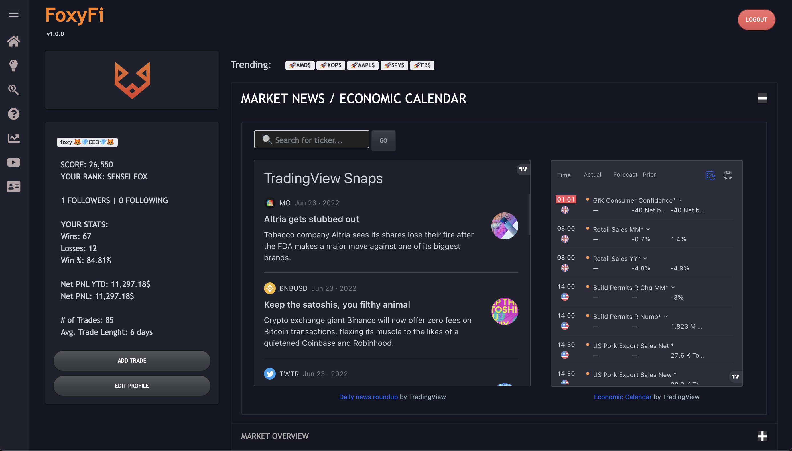

# FoxyFi

FoxyFi.cc - Educational website for anyone wanting to learn full stack web development by using 100% Python!

## Description

This website is built 100% using Python (except for the imports of widgets where copy pasted HTML templating from 
Trading View was required and the application of CSS styling to make it look as sleek as possible and ensure it can be as mobile friendly as possible!

### Dependencies

* This website is deployed and running on HEROKU
* Authentication management + Database is done using the Pyrebase library in Python to interact with a Real-Time Google Firebase database.
* Graphical Stock analysis + Technical Analysis + News Feeds are personalized Trading View widgets that can be imported straight into Dash using the
```html.Iframe()``` component from dash-html-components!

### Installing

* Ensure you have are running python 3.7 or higher
* Setup your own Firebase Database and configure it into the project's database.py file 
 (i have done a tutorial on this using python which you can find on my youtube channel - https://www.youtube.com/foxyfi )
```
pip install -r requirements.txt
```

### Executing program

* To run the application locally o your machine simply open the terminal inside your IDE and run :
* Step-by-step bullets
```
python app.py
```

## Help

Feel free to reach out to me on YouTube, LinkedIn, Twitter or Instagram with any questions you may have.
* [YouTube](https://www.youtube.com/foxyfi)
* [Twitter](https://twitter.com/Silviogobet)
* [LinkedIn](https://www.linkedin.com/in/silviogobet/)
* [Instagram](https://www.instagram.com/silviogobet/?hl=en)

## Authors

FoxyFi - Silvio Gobet


## Acknowledgments

Inspiration, library documentation, etc.
* [ThetaGang.com](https://thetagang.com)
* [Plotly Dash](https://plotly.com/dash/)
* [Dash Bootstrap Components](https://dash-bootstrap-components.opensource.faculty.ai)
* [Trading View Widgets](https://www.tradingview.com/widget/)
